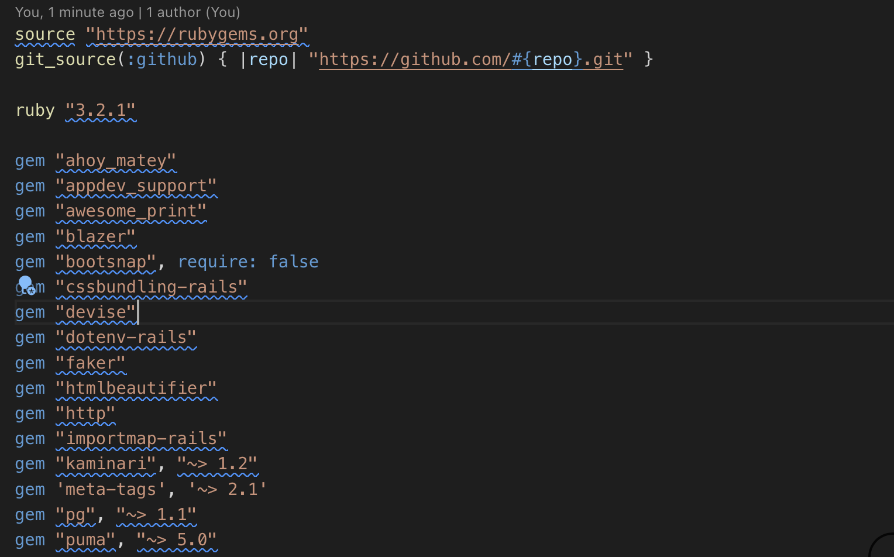
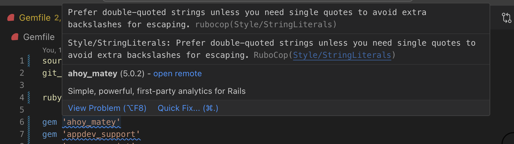
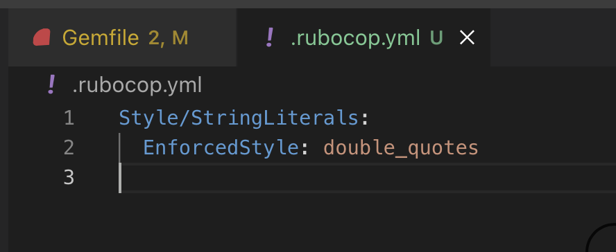
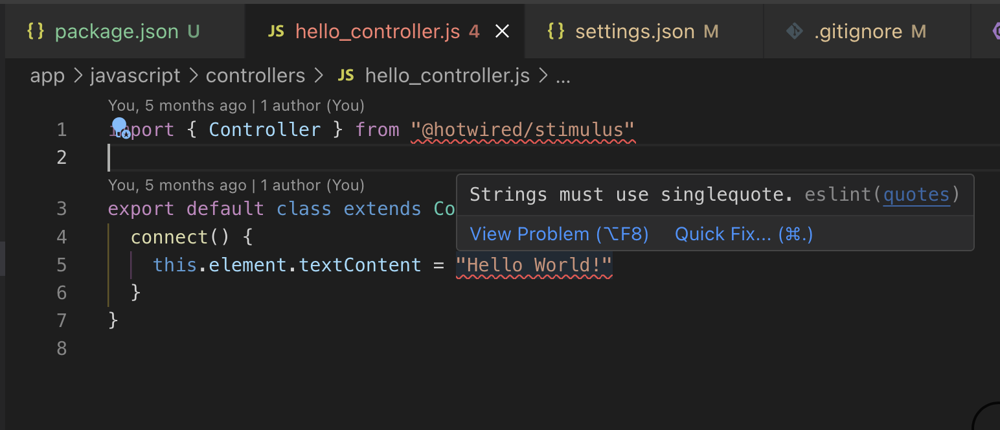
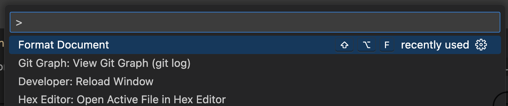

# Style Guides and Linters 🕺💃

## Introduction to Style Guides and Linters
Writing clean and maintainable code is crucial in software development, particularly when working in teams. In this lesson, we'll delve into the importance of adhering to style guides and using linters to enforce these standards in Ruby on Rails projects. We'll also guide you through setting up RuboCop and ESLint in your project using Visual Studio Code.

## Why Style Guides Matter
A style guide provides a coherent set of rules for code formatting and best practices within a programming language. Adhering to a style guide ensures that code is consistent and easy to understand, reducing the mental overhead for developers navigating the codebase.


## Recommended Ruby Style Guides
- [Community Ruby Style Guide](https://rubystyle.guide/): Community maintained guidelines based on the principle "Programs must be written for people to read, and only incidentally for machines to execute."[*](https://rubystyle.guide/#guiding-principles)
- [Shopify's Ruby Style Guide](https://ruby-style-guide.shopify.dev/): Offers conventions tailored to large-scale applications, emphasizing clarity and scalability.


## Linters and Code Analyzers
Linters are tools that help identify issues like syntax errors, stylistic errors, and other potential problems before they become more serious. They play a vital role in maintaining code quality.

## RuboCop 🤖
[RuboCop](https://github.com/rubocop/rubocop) is a static code analyzer for Ruby, based on the [community style guide]((https://rubystyle.guide/)). It can also format code, fixing issues automatically.

<!-- 

https://github.com/rubocop/rubocop-rails
 -->

### Integrating RuboCop
To integrate RuboCop into your Rails project, follow these steps:

1. Add RuboCop to your Gemfile.
```ruby
# only needed in the development environment
group :development do
  ...
  # Set the require option to false, as it is a standalone tool.  
  gem 'rubocop', require: false
  ...
end
```

2. Run `bundle install` to install the gem.

3. Create a `.rubocop.yml` file at the root of your project to customize rules if necessary.

```bash
touch .rubocop.yml
```

4. To analyze your project, run:
```bash
rubocop
```

5. To automatically fix issues, run:
```bash
rubocop -a
```

### Visual Studio Code Extensions for Rubocop
[VSCode RuboCop](https://marketplace.visualstudio.com/items?itemName=rubocop.vscode-rubocop) integrates RuboCop into VSCode, providing real-time feedback and autocorrection features directly in your editor.







You can also use the command pallette (⌘ + shift + p) to call 'Format Document' to auto-correct any file using rubocop.

Consider adding the [rubocop-rails](https://github.com/rubocop/rubocop-rails) gem if you prefer to follow best practices for rails apps (instead of customizing to your preferences).

## ESLint
[ESLint](https://eslint.org/) is a static code analyzer for JavaScript. It can also format code, fixing issues automatically.

### Integrating ESLint
1. Install ESLint globally or in your project.

```bash
npm install eslint --save-dev
```

2. Initialize ESLint to create an .eslintrc configuration file.
```bash
npx eslint --init
```

<aside>
During the initialization, you will be asked a series of questions about your coding style preferences and your environment (such as which framework you are using, whether you use React, etc.). You can also choose to extend popular configurations like the Airbnb style guide.
</aside>

3. Customize the configuration. Your `.eslintrc` should look something like this.

```json
{
  "env": {
    "browser": true,
    "es2021": true
  },
  "extends": [
    "airbnb-base",
    "eslint:recommended" 
  ],
  "parserOptions": {
    "ecmaVersion": 12,
    "sourceType": "module"
  },
  "rules": {
    "import/no-unresolved": 0
  }
}

```

4. Lint your JavaScript files.

```bash
npx eslint yourfile.js
```
For a more comprehensive check, you can run ESLint on all files in a directory like this:

```bash
npx eslint .
```

5. Fix Issues Automatically
ESLint can automatically fix many of the issues it detects. To enable this feature, use the `--fix` option.

```bash
npx eslint . --fix
```
This will modify the files where possible to conform to the style rules defined in your configuration.

You can also add a lint script to your package.json. This way you'll call `npm run lint` to lint your Javascript files.

```json
"scripts": {
  "lint": "eslint ."
}
```

### Visual Studio Code Extensions for ESLint
- [ESLint VSCode Extension](https://marketplace.visualstudio.com/items?itemName=dbaeumer.vscode-eslint): Integrates ESLint into VSCode enabling real-time linting.



## HTML, CSS and ERB Formatting
It's essential to maintain clean code in your HTML, CSS, and ERB templates as well.

- [HTMLLint](https://html-lint.com/): Provides a free online validator and reformatter tool for HTML.
- [Google HTML/CSS Style Guide](https://google.github.io/styleguide/htmlcssguide.html): Provides conventions for writing consistent, clean HTML and CSS.
- [HTMLBeautifier](https://github.com/threedaymonk/htmlbeautifier): A tool for beautifying `html.erb` files, ensuring they are readable and well-structured.
- [VSCode ERB Beautify](https://marketplace.visualstudio.com/items?itemName=aliariff.vscode-erb-beautify): An extension for Visual Studio Code that formats ERB files.
- [StyleLint](https://github.com/stylelint/stylelint): CSS linter that helps you avoid errors and enforce conventions.
- [erb-lint](https://github.com/Shopify/erb-lint): a linter specifically designed for ERB templates in Rails. It can lint Ruby code within ERB files and ensure it meets the guidelines you specify.

### Integrating HTMLBeautifier into VSCode
<!-- TODO: format document -->
<!-- cmd + shift + p -> format document for views -->
We can leverage the Formatter API from the vscode to format our ERB files, so no need to create a hack using a Task or CLI command.

1. Install [HTMLBeautifier](https://github.com/threedaymonk/htmlbeautifier) and [VSCode ERB Beautify](https://marketplace.visualstudio.com/items?itemName=aliariff.vscode-erb-beautify)

```ruby
# only needed in the development environment
group :development do
  ...
  # Set the require option to false, as it is a standalone tool.  
  gem 'htmlbeautifier', require: false
  ...
end
```

2. Use the command pallette (⌘ + shift + p) to call 'Format Document'.



<!-- TODO: add config steps? -->

## Quiz
- Why are style guides important in software development?
- They make the code more colorful.
  - Not correct. Style guides focus on formatting and best practices.
- They ensure code is consistent and easy to understand.
  - Correct! Style guides provide a set of rules for code formatting and best practices.
- They speed up the execution of code.
  - Not correct. Style guides do not affect code execution speed.
{: .choose_best #importance_of_style_guides title="Importance of Style Guides" points="1" answer="2"}

- What is the primary function of a linter?
- To execute the code.
  - Not correct. Linters do not execute code.
- To identify and fix syntax and stylistic errors.
  - Correct! Linters help maintain code quality by identifying issues.
- To compile the code.
  - Not correct. Linters do not compile code.
{: .choose_best #function_of_linter title="Function of a Linter" points="1" answer="2"}

- Which gem can be used to enforce Ruby style guidelines in a Rails project?
- `faker`
  - Not correct. Faker is used to generate fake data.
- `devise`
  - Not correct. Devise is used for authentication.
- `rubocop`
  - Correct! RuboCop is used for enforcing Ruby style guidelines.
{: .choose_best #ruby_style_gem title="Gem for Ruby Style Guidelines" points="1" answer="3"}

- ESLint can automatically fix many of the issues it detects in JavaScript files.
- True
  - Correct! ESLint has an option to automatically fix issues.
- False
  - Not correct. ESLint can indeed fix many issues automatically.
{: .choose_best #eslint_fix title="ESLint Automatic Fix" points="1" answer="1"}

- Using a linter ensures that your code has no runtime errors.
- True
  - Not correct. Linters identify syntax and stylistic errors, but not runtime errors.
- False
  - Correct! Linters do not guarantee the absence of runtime errors.
{: .choose_best #linter_runtime_errors title="Linter and Runtime Errors" points="1" answer="2"}

## Conclusion
Adhering to style guides and utilizing linters are practices that significantly enhance the quality of your code. They ensure your code remains clean, consistent, readable and maintainable, facilitating better collaboration and fewer bugs. By incorporating these tools into your development workflow, you promote a higher standard of coding practices across your team.

## Resources
- [RuboCop Documentation](https://github.com/rubocop/rubocop): Detailed information on configuring and using RuboCop in your Rails projects.
- [Shopify's Ruby Style Guide](https://ruby-style-guide.shopify.dev/): Insights into Shopify's approach to Ruby coding standards.
- [Google HTML/CSS Style Guide](https://google.github.io/styleguide/htmlcssguide.html): Guidelines for writing clean, consistent HTML and CSS.
- [Airbnb's Javascript Style Guide](https://github.com/airbnb/javascript): Insights into Airbnb's appraoch to Javascript coding standards.
- [W3 School's Javascript Conventions](https://www.w3schools.com/js/js_conventions.asp)
- [HTMLBeautifier](https://github.com/threedaymonk/htmlbeautifier/): Tool for formatting HTML.erb files.
- [Rufo: (Ruby formatter)](https://marketplace.visualstudio.com/items?itemName=mbessey.vscode-rufo): VS Code extension for formatting ruby files using the [rufo](https://github.com/ruby-formatter/rufo) gem.

## Follow Up Exercise
Integrate RuboCop into your Rails project and configure it using a `.rubocop.yml` file. Run RuboCop to identify and fix issues in your code.
